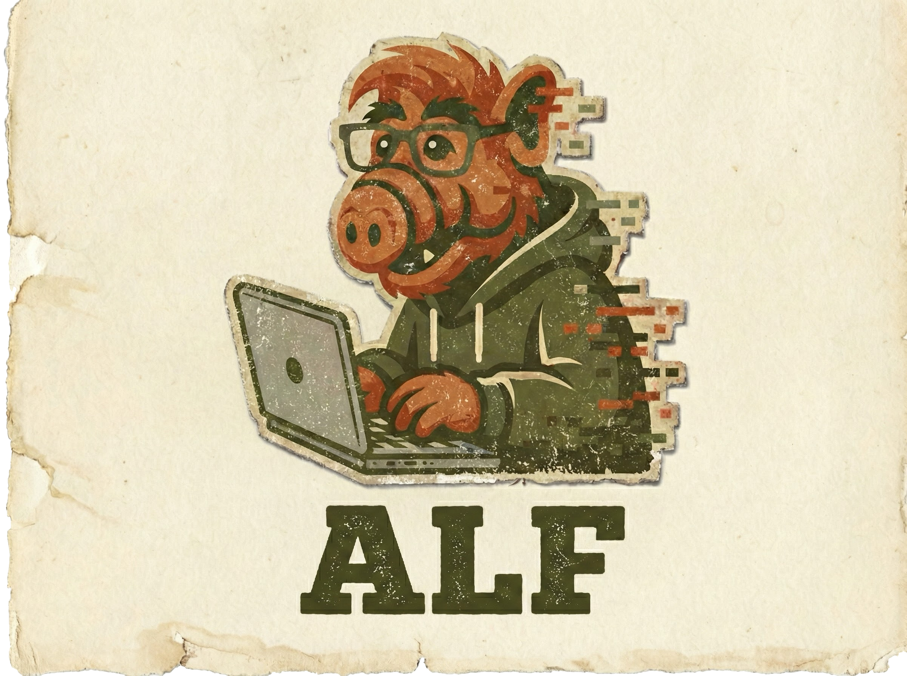

<p align="center">
  <a href="https://github.com/blacktop/alf"></a>
  <h3><p align="center">Agentic LLDB Fuzzer</p></h3>
</p>

ALF lets an AI drive LLDB via the Model Context Protocol to explore crashes, inject mutation hooks, and generate targeted fuzzing corpus. Focused on **Apple Mach-O targets on arm64(e)**.

## Getting Started

```bash
# 1. Install
uv sync --dev

# 2. Check prerequisites (lldb-dap, Developer Mode, etc.)
uv run alf doctor

# 3. Pick an LLM provider
uv sync --extra anthropic        # or openai, google, all-providers
export ANTHROPIC_API_KEY=sk-ant-...

# 4. Try it on the example target
make -C examples/toy_bug
uv run alf analyze --pipeline \
  --binary examples/toy_bug/out/toy_bug_fuzz \
  --crash examples/toy_bug/crashes/crash_div0
```

## Commands

### Crash Triage (`alf analyze`)

Post-mortem crash analysis: triage, classify, report, minimize, corpus generation.

```bash
# Full pipeline (triage -> classify -> report)
uv run alf analyze --pipeline --binary ./fuzz_bin --crash ./crash_input

# Individual steps
uv run alf analyze triage --binary ./fuzz_bin --crash ./crash_input
uv run alf analyze classify --binary ./fuzz_bin --crash ./crash_input --dap-log ./triage.json
uv run alf analyze report --context-json ./triage.json
uv run alf analyze minimize ./fuzz_bin ./crash_input
uv run alf analyze corpus ./fuzz_bin ./crash_input --llm
```

### Fuzzing (`alf fuzz`)

Three fuzzing engines, all under `alf fuzz`:

```bash
# LLM-driven fuzzing with mutation hooks (default)
uv run alf fuzz auto ./fuzz_bin --corpus ./seeds

# Hybrid: LLM cold-start + native libFuzzer + LLM triage
uv run alf fuzz hybrid ./fuzz_target --corpus ./seeds --max-time 3600

# Jackalope/TinyInst hybrid (macOS framework fuzzing)
uv run alf fuzz jackalope ./harness \
    --fuzzer /path/to/fuzzer \
    --corpus ./in \
    --instrument-module ImageIO \
    --target-method _fuzz \
    --persist --delivery shmem --threads 4
```

**Jackalope prerequisites**: Build from [googleprojectzero/Jackalope](https://github.com/googleprojectzero/Jackalope). See `docs/JACKALOPE.md`.

### Interactive MCP Server (`alf server`)

Expose 40+ LLDB tools for Claude/Gemini/GPT to drive interactively.

```bash
uv run alf server --transport stdio
uv run alf server --transport sse --listen-port 7777
```

### Director Mode (`alf director`)

End-to-end AI director loop for crash analysis:

```bash
uv run alf director --binary ./fuzz_bin --crash ./crash_input --mode auto
```

## LLM Providers

```bash
export ANTHROPIC_API_KEY=sk-ant-...   # Claude (recommended)
export OPENAI_API_KEY=sk-...          # GPT
export GOOGLE_API_KEY=...             # Gemini
```

Auto-detection priority when `--provider` is not specified:
1. `ALF_LLM_PROVIDER` env var
2. `ANTHROPIC_API_KEY` present
3. `OPENAI_API_KEY` present
4. `GOOGLE_API_KEY` present
5. Local server probe (ports 11434, 1234, 8000, 8080)

For local models (Ollama/LM Studio):
```bash
uv run alf fuzz auto ./bin --provider ollama --model llama3.2
```

## Binaries

| Binary | Purpose |
|--------|---------|
| `alf` | Main CLI |
| `alf-llm` | LLM adapter (stdin/stdout JSON chat). Used internally by `alf analyze classify`. Not an MCP server. |

## macOS Setup

```bash
uv run alf doctor  # Check prerequisites
```

If you see `process exited with status -1`, enable Developer Mode in System Settings > Privacy & Security > Developer Mode.

## Configuration

Copy `.alf.toml` to your project root and customize. Key settings:
- `[provider]` - LLM provider and model
- `[lldb]` - Backend selection (dap/sbapi/lldb_mcp)
- `[fuzz]` - Fuzzing parameters
- `[director]` - Agent settings

## Documentation

- `docs/ARCHITECTURE.md` - System design
- `docs/QUICKSTART_MCP.md` - MCP server setup
- `docs/JACKALOPE.md` - Jackalope/TinyInst integration guide
- `examples/README.md` - Example harnesses
- `skills/README.md` - Claude / Claude Code skills for driving alf

## License

Apache 2.0 Copyright (c) 2025 **blacktop**
